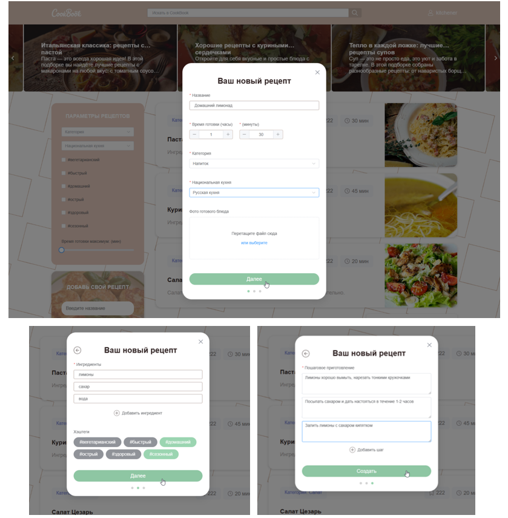
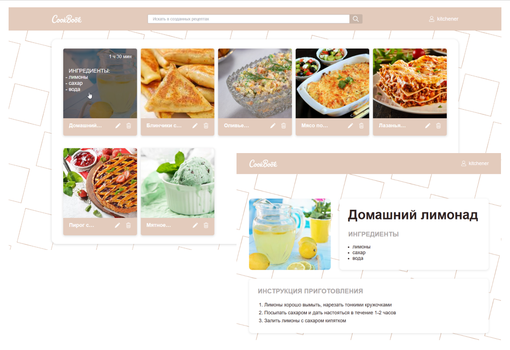

# CookBook
Приложение для любителей кулинарии.

Пользователь может листать ленту рецептов, фильтровать их по категориям, кухням, хэштегам и времени приготовления, открывать детальную страницу с ингредиентами и шагами приготовления, сохранять понравившиеся рецепты в избранное, а также добавлять собственные через форму создания.




## Технологический стек

### Frontend
- **Vue 3** - прогрессивный JavaScript-фреймворк
- **TypeScript** - типизированный JavaScript для надежного кода
- **Vue Router 4** - официальный роутер для Vue.js
- **Pinia** - современное state-management решение для Vue
- **Element Plus** - UI-библиотека компонентов
- **Vue3 Carousel** - карусель для Vue 3
- **Axios** - HTTP-клиент для API запросов
- **SASS** - препроцессор CSS

### Development Tools
- **Vue CLI** - стандартный инструмент для разработки Vue проектов
- **ESLint** - линтер для JavaScript/TypeScript
- **Prettier** - форматтер кода
- **Jest** - фреймворк для тестирования
- **Vue Test Utils** - утилиты для тестирования Vue компонентов

## Установка и запуск

### Предварительные требования

- Node.js (версия 14 или выше)
- npm или yarn
- Backend API сервер на `http://localhost:8080`

### Установка зависимостей

```bash
npm install
```

### Запуск в режиме разработки

```bash
npm run serve
```

Приложение будет доступно по адресу `http://localhost:8080` (или другому порту, если 8080 занят).

### Сборка для продакшена

```bash
npm run build
```

Собранные файлы будут находиться в директории `dist/`.

### Запуск тестов

```bash
npm run test:unit
```

### Проверка и исправление кода

```bash
npm run lint
```

## Структура проекта

```
src/
├── assets/          # Статические ресурсы (стили, изображения)
├── components/      # Переиспользуемые Vue компоненты
│   ├── BaseModal.vue
│   ├── CardList.vue
│   ├── CustomInput.vue
│   ├── Logout.vue
│   ├── Pagination.vue
│   ├── RecipeCard.vue
│   ├── SvgIcon.vue
│   ├── TheCard.vue
│   ├── TheHeader.vue
│   └── TheSlider.vue
├── const/           # Константы приложения
├── helpers/         # Вспомогательные функции
├── router/          # Конфигурация маршрутизации
├── service/         # API сервисы
│   ├── authService.ts
│   └── recipeService.ts
├── store/           # Pinia хранилища
│   ├── auth.ts
│   └── index.ts
├── types/           # TypeScript интерфейсы и типы
├── views/           # Компоненты страниц
│   ├── Authorization.vue
│   ├── MainPage.vue
│   ├── NotFound.vue
│   ├── RecipeCollections.vue
│   ├── RecipeDetails.vue
│   ├── SavedRecipes.vue
│   └── SignUp.vue
├── App.vue          # Корневой компонент
└── main.ts          # Точка входа приложения
```

## API Endpoints

Приложение взаимодействует с backend API:

- `GET /api/v1/recipes` - получение списка рецептов
- `GET /api/v1/recipes/:id` - получение рецепта по ID
- `GET /api/v1/recipes/types` - получение категорий блюд
- `GET /api/v1/recipes/cuisines` - получение списка кухонь
- `GET /api/v1/recipes/hashtags` - получение хэштегов
- `POST /api/v1/recipes` - создание нового рецепта (требуется авторизация)
- `DELETE /api/v1/recipes/:id` - удаление рецепта (требуется авторизация)

## Основные компоненты

### Страницы (Views)
- **MainPage** - главная страница со слайдером и списком рецептов
- **RecipeCollections** - коллекции рецептов с фильтрами
- **RecipeDetails** - детальная информация о рецепте
- **SavedRecipes** - сохраненные пользователем рецепты
- **Authorization** - страница входа
- **SignUp** - страница регистрации

### Компоненты (Components)
- **TheHeader** - шапка сайта с навигацией
- **TheSlider** - карусель на главной странице
- **CardList** - список карточек рецептов
- **RecipeCard** - карточка отдельного рецепта
- **Pagination** - пагинация для списков
- **BaseModal** - модальное окно
- **CustomInput** - кастомный input компонент

## Авторизация

Приложение использует JWT-токены для авторизации. После успешного входа токен сохраняется в Pinia store и используется для защищенных API запросов.

## PWA Support

Проект поддерживает Progressive Web App функциональность через Service Worker для оффлайн работы.

## Лицензия

Этот проект создан в образовательных целях.

## Автор

Разработано в рамках pet-проекта для изучения Vue 3 и TypeScript.

---

**Приятного использования!**
